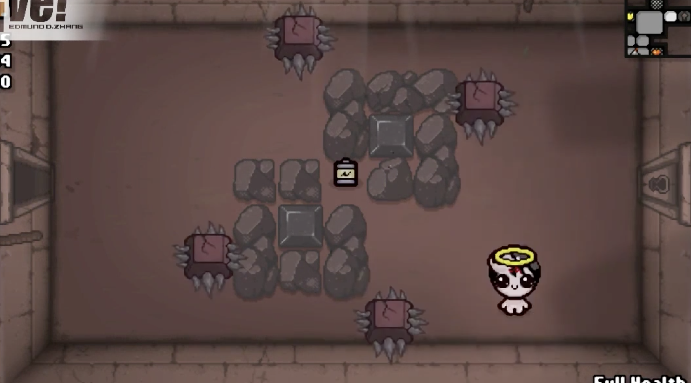
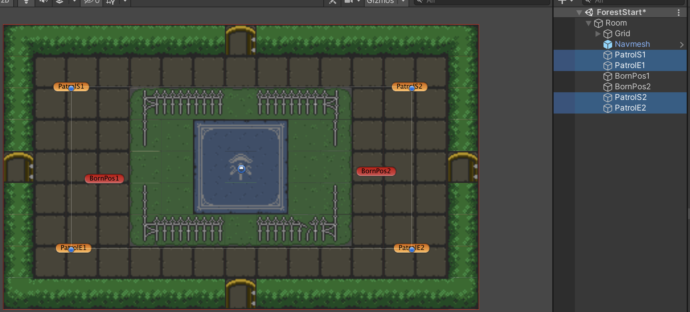
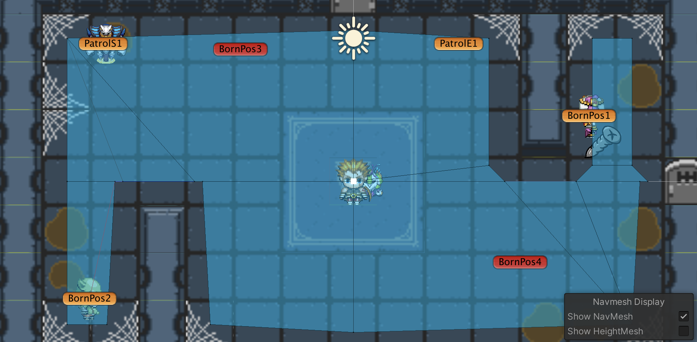
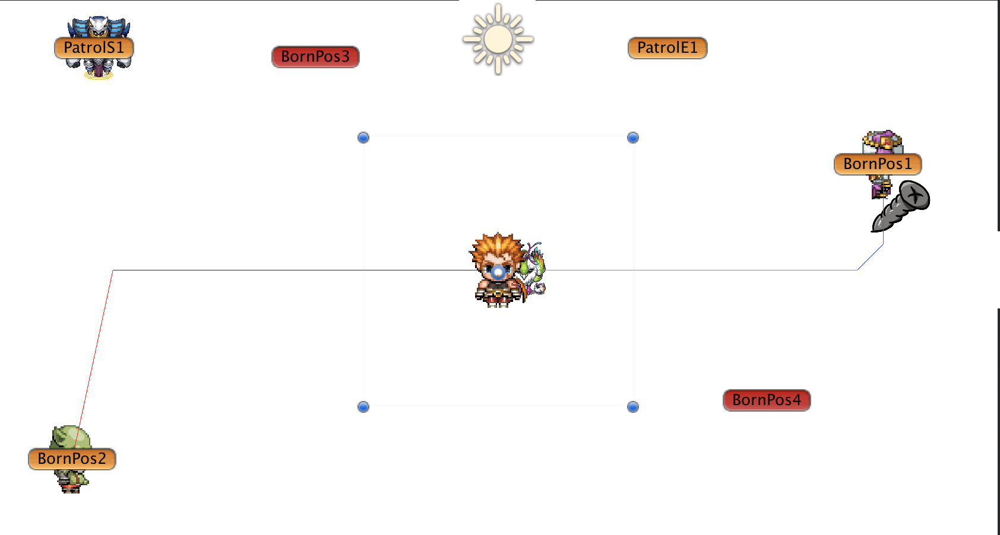
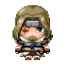
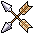
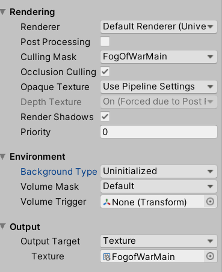
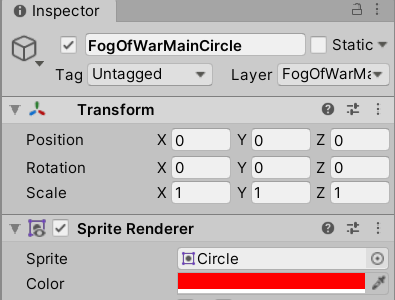

# War Force: Dungeon

## 项目介绍

- [War Force: Dungeon](#war-force-dungeon)
  - [项目介绍](#项目介绍)
    - [项目概述](#项目概述)
    - [游戏背景](#游戏背景)
    - [开发工具](#开发工具)
    - [版本协作](#版本协作)
    - [基本交互](#基本交互)
  - [设计思路](#设计思路)
    - [玩法设计](#玩法设计)
    - [关卡设计](#关卡设计)
  - [功能实现](#功能实现)
    - [Dungeon Room](#dungeon-room)
    - [Enemy](#enemy)
    - [Familiar](#familiar)
    - [Item System](#item-system)
    - [Bullet System](#bullet-system)
    - [Animation](#animation)
    - [Effect](#effect)
    - [UI](#ui)
    - [Fog of War](#fog-of-war)

### 项目概述

本游戏起初为模仿以撒的结合 Binding of Isaac 的一款俯视角地牢游戏，玩家控制角色以远程攻击、近战攻击、炸弹等方式消灭敌人。玩家在游戏过程中不断地收集道具来使自身变强以应对更多更强的敌人。

### 游戏背景

在诸神的黄昏 (Ragnarok) 中，主角提尔 (Týr) 分别在中庭 (Midgard)、亚尔夫海姆 (Álfheimr) 和冥界 (Hel) 中挑战与诸神展开决战的巨人们：

- 巨狼芬里尔 (Fenrir)
- 世界之蛇耶梦加得 (Jormungand)
- 冥界女王海拉 (Hel)

### 开发工具

- Unity 2019.3.1f1

### 版本协作

Github: https://github.com/omf2333/42019801GameProgramming

### 基本交互

|    操作     |     描述     |
| :---------: | :----------: |
|   W A S D   |   移动角色   |
| 1 2 3 4 5 6 | 切换子弹类型 |
|      J      |   远程射击   |
|      Q      |   切换道具   |
|      T      |     护盾     |
|      F      |   使用道具   |
| Blank space |   近战攻击   |

## 设计思路

### 玩法设计

玩家通过使用键盘和鼠标控制角色的行为来进行游玩闯关。每一关都有若干个房间，玩家需要找到当前关卡中的`Boss`房间，打败`Boss`才能进入到下一个关卡，当打败所有关卡的`Boss`则达成通过条件。其中，玩家在进入到某一关的某一房间中时，需要清除房间中的所有可消灭的敌人才可以进入下一个房间。

玩家可以使用键盘来控制角色的移动，可以使用键盘来控制角色的技能释放，比如近战攻击、远程攻击、开启护盾等，可以使用键盘或者鼠标来选择道具栏中的道具使用。

玩家会遇到多种不同的`Enemy`、`Boss`、陷阱，玩家需要利用各种道具、技能、甚至地形来巧妙应对才可以高效地击败敌人通过房间。

`Enemy`和`Boss`死亡以及打开宝箱都会掉落道具，玩家可以通过拾取道具来强化自身属性或产生一些对玩家有利的效果。

角色拥有固定上限的生命值和魔法值，当生命值小于0时角色死亡。而角色使用技能时则需要耗费一定量的魔法值。其中，魔法值会随时间回复，而生命值不会。

角色死亡后会回到第一关，但是角色的属性不会归档，因此玩家可以通过不断地打怪来提升属性进行闯关。

### 关卡设计

由于我们找到的 Tilemap 素材比较拉垮（又怕风格太割裂没有再找别的 Tilemap 素材去设计），所以在地图的设计上比较中规中矩没什么太多的亮点，这边我们挑选了比较有代表性的及格关卡来介绍一下我们的敌人设计配合地形的关卡设计。

#### Midgard (Multiple waves of enemies)


图示是第一关 Midgard 中的一个关卡，进入房间后可以看到有一个冲撞向玩家的 DashEnemy 和两个只会垂直方向发射激光相向而行的 LaserEnemy，敌人的 AI 和特性会在后面的文档中提到。玩家在这个关卡中的最优解法是先躲避 dashEnemy 的一次冲撞，然后迅速杀死一个 laserEnemy，否则当 laserEnemy 到中心相遇时玩家会受到相当多的伤害。


当以上三个敌人被消灭之后，随即会出现第二波敌人，第二波敌人由一个发射子弹的 shooterEnemy 和两个固定线路的移动地刺组成，由于玩家在躲避 shooterEnemy 的子弹时通常习惯性地会往角落处躲避，因此在这里设计两个地刺作为这一房间的一个难点。

像这样的多波敌人的关卡设计贯穿整个游戏；即使是在随机生成敌人的房间，我们也设定了一定的概率出现第二波甚至第三波敌人以增强关卡的可玩性。

#### Álfheimr (Swamp and spikes)


这一关中我们看到地图的四周都有沼泽 Swamp，角色在该地形上移动速度会降低，我们在地图的中心还设置了一个 laserEnemy，配合沼泽地形的减速会使得玩家在处理这个敌人上更加棘手。


道路的中央还有地刺陷阱，当地刺升出的时候会对玩家造成伤害。

#### Álfheimr (Gears)


第二关中的宝箱房中，我们可以看到四个按顺时针转动的齿轮，经我们测试，玩家需要靠近罐子并用炸弹炸开罐子来打开宝箱。此外，玩家是无法逆着齿轮的方向从地图的下方通过而不收到伤害。

#### Hel (Lava, Gears and Spikes)


这边为了截图方便我关闭了战争迷雾效果，在这一关中，我们在四周设置了岩浆（用户站在岩浆上会每秒扣血），房间的中央设置了三个不同方向运动的齿轮以及七个地刺，玩家需要思考相应的对策来通过这一个关卡，尤其是在战争迷雾开启的状态下玩家的视野受限通过此关的难度较高。

在游戏的最后两关，我们设置的Enemy和陷阱都比第一关多，这也是根据玩家在进入后两关之后捡到的道具增多了，我们也相应地讲关卡的难度上升。

## 功能实现

### Dungeon Room

Dungeon Room 的生成是游戏中的核心模块，本部分只着重阐述房间生成的逻辑、特殊地形物品以及过程生成房间的逻辑。

#### Room

考虑到 2D UI 素材比较难找（找到风格也很难统一），以及 Tilemap 的强可塑性、多样性，此外，大一做 [cocos2d-x 游戏](https://github.com/Greilfang/Our-Red-Alert) 时也用到了 Tilemap 编辑工具 Tiled，相对而言比较熟悉，我们找到了不同的 Tilemap 素材（主要是一些 RPG 游戏素材）来绘制地图。

我们将每个房间都单独做成一个 scene，这样做主要考虑到以下两点：

1. 制作完一个 Room 的地图后，通过复制再稍加改动就可完成新的地图；
2. 过程生成时房间可复用（随机生成）

Room 中一些主要的 GameObject:

|    Tilemap    | Order in Layer | Active by  Default | Walkable |                         Description                          |
| :-----------: | :------------: | :----------------: | :------: | :----------------------------------------------------------: |
|    Terrain    |       0        |        true        |   true   |                       房间地面（地板）                       |
|     Wall      |       1        |        true        |  false   |          主要是四周的墙（也包括部分不可通过的障碍）          |
|  Decoration   |       2        |        true        |   true   |           装饰，如 `Basement` 地图中的蜘蛛网和油渍           |
|     Door      |       1        |        true        |   true   | 四周的门，第一关是写死的，后面的 Procedural Generation 的关卡是自动设置的 |
|  Locked Door  |       2        |       false        |  false   |                 当房间内存在敌人时，门会锁上                 |
| SeparatedWall |       2        |       false        |  false   |                  自动生成模式下用来填充的墙                  |
|   Treasure    |       2        |        true        |  false   |                     宝箱，靠近时自动打开                     |
|      Key      |       1        |        true        |   true   |    钥匙，用于开第一关中的宝箱房的门，玩家靠近后会自动拾取    |
|    Navmesh    |       -        |        true        |    -     |                         用于敌人寻路                         |
|     Swamp     |       1        |        true        |   true   | 第二关地图 `Forest` 中的特殊地形，玩家走在上面会降低移动速度 |
|   Lava/Fire   |       1        |        true        |   true   |    第三关地图 `Hell` 中的特殊地形，玩家走在上面会逐秒掉血    |
|   EndPoint    |       1        |       false        |   true   |             Boss 房 Boss 死亡后通向下一关的通道              |
|     Spike     |    Default     |        true        |   true   |          地刺陷阱 Animation，地刺升起时会对玩家扣血          |
|      Jar      |    Default     |        true        |  false   |                         可打碎的罐子                         |
|    BornPos    |    Default     |        true        |    -     |       为敌人的生成位置（包括巡逻敌人的巡逻点）提供坐标       |
|    outline    |    Default     |        true        |    -     |                  用于小地图遮盖掉房间的细节                  |
|     wall2     |    Default     |        true        |    -     |                  用于小地图显示的房间的墙体                  |

在地图设计方面，我们自己设计了大部分的地图，并仿照 `Binding of Issac: Rebirth` 的地图，设计了一部分地图：




#### Terrain & Special Objects

这一部分涉及到的主要的 GameObject 及其脚本：

| GameObjects                                                  |      Scripts      |                         Description                          |
| ------------------------------------------------------------ | :---------------: | :----------------------------------------------------------: |
|  |     `Door.cs`     | 第一关中 `Door GameObject` 的 `MonoBehaviour`, 门上绑定了 `BoxCollider2D` 作为 Trigger, 当玩家进入时会跳转到相应的房间 |
|  |  `LockedDoor.cs`  |       第一关中宝箱房有一个锁着的门，需要用钥匙才能打开       |
|  |   `EndPoint.cs`   | Boss 房结束后会显示通向下一关的通道，该脚本实现 scene 的切换 |
|  |   `Tresure.cs`    |          玩家靠近宝箱后触发 Trigger 打开宝箱掉道具           |
|  |    `Swamp.cs`     |   沼泽地形的 `MonoBehaviour`，Player 进入后会降低移动速度    |
|  | `DamageOnStay.cs` | 火焰和熔岩地形的 `MonoBehaviour`，Player 踩到熔浆和火焰后，每秒掉血 |
|  |    `Spike.cs`     |   地刺陷阱的 `MonoBehaviour` ，地刺刺出时会对玩家造成伤害    |

#### Dungeon Room Controller

这一部分涉及到的主要的脚本：

|       Scripts       |                         Description                          |
| :-----------------: | :----------------------------------------------------------: |
|      `Room.cs`      | 每个房间的 `MonoBehaviour`，记录房间的基本信息（宽、高、坐标、门），并提供了基本的 set 和 get 方法 |
| `RoomController.cs` | 生成房间的控制器，使用了单例模式。记录了当前世界中所有房间的信息，并提供了依次生成当前世界房间与切换世界等方法 |

这边主要介绍一下我们原本非过程生成时的第一关 `Basement` 中八个房间的生成逻辑；在改为过程生成之后我们仍保留了这一关。

1. `public void LoadRoom(string name, int x, int y)` (`RoomController`)

    - `string name`: 房间名，对应于添加到 BuildSettings 里的 Scene 的名字

    - `int x, int y`: 房间的坐标，具体的坐标对应关系见下图

        

    - 该函数并不直接创建上述的房间，而是新建一个房间的信息，并将这些信息加入到 `loadRoomQueue` 这样的一个队列中

2. `void UpdateRoomQueue()` (`RoomController`)

    - 该函数在 `RoomController` 中的 `Update()` 中被每帧调用
    - 判断当前是否正在加载场景，如果不在加载中，则开启一个协程调用 `LoadRoomRoutine()` 来加载房间

3. `IEnumerator LoadRoomRoutine(RoomInfo info)` (`RoomController`)

    - `RoomInfo info` 即在 `LoadRoom()` 函数中记录下来的房间信息
    - 该函数使用 `SceneManager` 的 `LoadSceneAsync()` 方法来异步加载场景

4. `public void RegisterRoom(Room room)` (`RoomController`)

    - 在第三步中加载好场景后，由于每个 Scene 中都有个 `Room MonoBehaviour`，其 `Start()` 方法调用了这个方法来在 `RoomController` 中注册这个房间
    - 该方法将目前加载的房间保存起来，并执行一些初始化的操作
    - 置 `isLoadingScene` 为 `false` 表示当前房间已经加载并初始化完毕，可以加载新的房间了。

就此当前世界所有的房间都已经加载完了，而至于关门开门（判断房间内有无敌人）、切换世界、特殊地形伤害等的逻辑相对比较简单，这里不做说明。

#### Procedural Dungeon Generator

最后一周我们根据老师的需求又赶工做了房间的自动生成的逻辑，还是先介绍一下主要的脚本：

|            Scripts            |                         Description                          |
| :---------------------------: | :----------------------------------------------------------: |
|      `DungeonCrawler.cs`      |         定义了一个爬虫，在迭代中不断返回一个房间坐标         |
| `DungeonCrawlerController.cs` |   爬虫控制脚本，使用了单例模式，在一个主循环内控制多个爬虫   |
|     `DungeonGenerator.cs`     | `Room` 的 `MonoBehaviour`，获取上述爬虫得到的位置，并在这个位置上随机创建一个房间 |
|  `DungeonGenerationData.cs`   | 创建一个 `AssetMenu` 用于存放过程生成所需的数据，即爬虫的数据，循环的最小次数和最大次数 |

这一部分具体的逻辑相对而言比较简单，即

1. `DungeonGenerator` 先从 `DungeonGenerationData` 创建的 AssetMenu 中获取自动生成的一些常数，并使用这些数据来初始化一个 `DungeonCrawlerController` 实例；
2. `DungeonCrawlerController` 随即创建多个初始位置在原点的 `DungeonCrawler` （其个数为设定的一个常数，默认为 2）
3. 在指定的最小迭代次数和最大迭代次数中随机取一个数作为总的迭代次数
4. 在迭代的循环中，控制 `DungeonCrawler` 每次随机选择一个方向（上下左右）移动一个坐标
5. 记录下爬虫所经的坐标并将其返回给 `DungeonGenerator`
6.  `DungeonGenerator` 在当前世界的房间名列表中随机取一个房间名，根据上面得到的坐标随机地生成房间，生成、初始化房间的方式跟前一部分相同。
7. 在 `RoomController` 的 `LoadRoom()` 方法中，该函数会检查当前的坐标是否已存在一个房间；若存在则跳过来避免房间叠加的情况。

默认参数：

|     Parameter      | Type | Default Value |                         Description                          |
| :----------------: | :--: | :-----------: | :----------------------------------------------------------: |
| `numberOfCrawlers` | int  |       2       | 爬虫数，经我们测试，当爬虫数为2时，Start Room的位置相对更随机一些 |
|   `iterationMin`   | int  |      12       |                         最小循环次数                         |
|   `iterationMax`   | int  |      15       |                         最大循环次数                         |

而这引入了非随机生成的 RoomController 的遗留问题：

1. 不同于之前的非随机生成的房间，随机生成模式下的 Room Template 需要在生成后自动移除掉不与其他房间相连的门：

    - 将原来的 `Door` （在一个图层上有四个门）拆分成 `TopDoor`, `BottomDoor`, `LeftDoor`, `RightDoor`，并在生成好房间后调用 `RemoveUnconnectedDoors()` 方法来销毁未与别的房间相连的门；
    - 但上述方法也存在一个问题，假如在生成的过程中每生成一个房间就检测未相连的房间并销毁相应的门，会出现先生成的房间的门未被销毁的情况；
    - 这时只需在所有房间生成完之后，遍历生成的所有房间，调用 `RemoveUnconnectedDoors()`  方法。

2. 由于爬虫的逻辑是完全随机的，它不会避开已经爬过的位置，因此加入简单地将最后一个坐标作为 boss 房的坐标是不合适的，有的时候会出现加载不出 boss 房的情况，我们考虑了两种解决方案：

    - 使用算法来将爬虫经过的位置去重，并将最后一个坐标或随机选择一个坐标作为 boss 房的坐标，这种情况下有一定几率会出现 boss 房离开始房间很近的情况（甚至贴着 Start Room），这显然不是我们想要的结果；
    - 先正常地随机生成所有的房间（不包括 Boss 房），再找出这些房间中离 Start Room 最远的一个房间，销毁这个房间，并在这个位置上生成一个 Boss 房。

    最终我们选择了第二种方案。

### Enemy

#### 总的类图设计


- 图中只列出了一点最重要的方法和属性

#### 跟随型ai

该ai是基于状态机的，其状态图如下：


在不同状态下该ai的行为：

| 状态       | 行为                                                         |
| ---------- | ------------------------------------------------------------ |
| **Idel**   | 敌人的start时的状态，当敌人生成后会自动切换到Wander状态      |
| **Wander** | 在该状态下，敌人会在wanderRadius范围内的navmeshsurface上随机取一个点，作为终点进行移动；每过wanderChangeInterval时间后会重新选择终点 |
| **Follow** | 在该状态下，会每帧将玩家的坐标作为终点，进行寻路与移动       |
| **Attack** | 不同的敌人会有不同的攻击方式，攻击一次后会cooldown特定的时间 |
| **Die**    | 死亡后产生死亡效果，并随机掉落物品后destory掉自身            |

#### 巡逻型ai

其状态图如下：


在不同状态下该ai的行为：

| 状态       | 行为                                                         |
| ---------- | ------------------------------------------------------------ |
| **patrol** | 1.是徘徊巡逻：即达到巡逻的终点时，反向 <br>2.是绕圈巡逻：即巡逻终点也是起点 |
| **attack** | 在攻击的同时，依然保持着敌人的移动                           |

#### 移动方式

- 巡逻，未使用agent

    - 设定巡逻点数组destinationList，假设n个点

        - 徘徊巡逻：从 0—>n-1—>n-2—>0
        - 在该例子中，巡逻敌人从PatrolS1——>PatrolS2——>PatrolE2——>PatrolE1——>PatrolS1

        

        - 绕圈巡逻：从0—>n-1(0)—>1（类似于上面的设计，但起点和终点位置不同）

- 寻路：

    - 前期：使用基于Grid的A*多单位寻路，但遇到两个问题难以解决：1.敌人过多时容易重合 2.对角线移动时容易卡墙壁甚至穿强，后面就放弃了，转向使用NavMesh

        

    - 后期：使用基于[NavMeshPlus](https://github.com/h8man/NavMeshPlus)的来进行2D寻路，为每个FollowingEnemyAi的敌人设置agent，来自动进行寻路，其中agent在follow状态的stoppingDistance为attackRange/2 , wander 状态的stoppingDistance为0.5f

        

#### 攻击方式

- 镭射1

    - 闪烁的激光瞄准红线和激光都是用LineRender来实现的

    - 在持续发射激光的过程中，每0.1s使用RaycastHit2D来检测碰撞物体，会根据不同碰撞物体的类型来判断激光的终点，若是持续命中玩家，则会对玩家造成持续性伤害

        

- 镭射2

    - 无激光瞄准红线，激光方向为垂直与移动方向且朝向玩家一侧

        

- 炸弹

    - Bomb会将发射时玩家的坐标作为终点，到达终点后并不会销毁子弹，而是启动一个coroutine，让Bomb持续变大，直到一定时间后自动爆炸。在炸弹飞跃的过程中或者变大的过程中，玩家若是碰到都是会触发起爆炸，受到伤害。

    - 下图中的绿色方块为飞行中的炸弹，有圆环的为将要爆炸的炸弹

        

- 普通子弹

    - 在发射时会将发射时的起点到玩家的坐标作为方向，朝向该方向移动，直到碰到碰撞物销毁。

- 冲撞：

    - 发起攻击的时刻，将玩家的当前坐标作为终点，停止agent的移动，通过MoveTowards方式快速移动到终点，在移动路径中若是碰到玩家，则对其造成伤害

#### 受伤效果

- 弹出数值文本

    每次受到伤害都会向斜上方弹出受伤的数值文本(**TextMeshPro**)， 并且会有个消失时间，在这段消失时间里文本不断向其设定的方向移动同时不断变大，到达一个时间界线后不断变小到消失。

- 敌人闪烁：（lps）

#### 生成方式

主要有两种方式：

1. 随机生成：在一个房间内以房间为中心，以一定的半径划定生成范围，根据生成的敌人的数量，等间隔角度在有navmesh覆盖的位置生成

2. 固定套路生成：在每个房间内指定好每波敌人的类型，以及每波敌人生成的位置，然后在不随机的情况下就按安排好的顺序生成敌人；在随机的情况下，则随机从第i波敌人开始，下一波敌人的生成也是随机从后面波中随机选取的。其中要说明一下的是boss是固定于房间中央生成的。

    

其中不同波的敌人的位置都用不同颜色标签以区分，其中每个关卡的每种敌人都创建一个ScriptableObject (SpawnerData) asset


#### Boss

<table>
    <tr>
        <td></td>
        <td>Level 1</td>
        <td>Level 2</td>
        <td>Level 3</td>
    </tr>
    <tr>
        <td>GameObjects</td>
        <td>
            
        </td>
        <td>
            
        </td>
        <td>
            
        </td>
    </tr>
    <tr>
        <td>Skills</td>
        <td>
            单发子弹射击、360°子弹射击、分裂
        </td>
        <td>
            保护盾、回血、全屏攻击
        </td>
        <td>
            全屏攻击、360°子弹射击、保护盾、回血、分裂
        </td>
    </tr>
</table>

| 技能         | 描述                                                         |
| ------------ | ------------------------------------------------------------ |
| 全屏攻击     | 全屏范围内攻击，无法躲避，攻击前会变红蓄力，释放攻击期间全屏抖动 |
| 保护盾       | 开启保护盾后，玩家无法对其造成伤害                           |
| 分裂         | boss死后，会分裂为4个子boss                                  |
| 回血         | 快速恢复血量                                                 |
| 单发子弹射击 | Boss向玩家方向射击一发随机属性的子弹                         |
| 360°子弹射击 | Boss以自己为圆心延时发射一系列随机属性子弹                   |

**全屏攻击效果**：相机抖动实现 （ScreenShakeController.cs）

相机距离的更新都是在LateUpdate()中进行的，因为 LateUpdate是在所有Update函数调用后被调用，适合用于相机的更新

| 属性               | 描述                                                      |
| ------------------ | --------------------------------------------------------- |
| shakePower         | 水平和垂直方向的位移距离，会随着抖动倒计时的而不断减小至0 |
| shakeFadeTime      | 抖动的持续时间                                            |
| shakeRotation      | 相机绕z轴旋转角度，会随着抖动倒计时的而不断减小至0        |
| shakeTimeRemaining | 抖动倒计时                                                |

**保护盾（ShieldController.cs）**：

保护盾的动画使用粒子效果实现的

- 开启护盾：播放该粒子系统，同时设置好CircleCollider2D的半径作为保护罩
- 关闭护盾：停止该粒子效果的播放并清除，同时设置其CircleCollider2D半径为0


**分裂**：

- 在可分裂boss血量<0后，进入Die状态时，在Navmesh上以boss的1.5倍大小为半径，随机选取四个在该房间内的点作为生成点，生成分裂的小boss，生成后才destroy掉原boss。

**回血**：

- 效果：boss的outline会变绿，在一个coroutine中血量会逐步恢复

#### Enemy数值

##### 跟随型普通敌人

游戏中，跟随类型敌人主要按攻击方式分为4类，且同一类小怪在每个关卡的外型不同：

- 炸弹类：
    - 基本属性：血量较高，攻击范围较大，攻击间隔较长；
    - 攻击方式：向玩家扔掷炸弹，扔掷速度较慢，在到达目标位置后逐渐膨胀并爆炸；
- 冲撞类：
    - 基本属性：血量较低，攻击范围较小，快速切换漫步方向；
    - 攻击方式：当玩家处于其攻击范围内时，朝玩家方向快速冲撞；
- 激光类：
    - 基本属性：血量一般，攻击范围较大，攻击间隔较长；
    - 攻击方式：首先向玩家当前位置发出激光瞄准红线，一定时间后发射激光造成较高持续伤害；
- 射击类：
    - 基本属性：血量、攻击范围、攻击间隔等属性较为均衡；
    - 攻击方式：向玩家射击子弹，射击速度较快。

<table>
    <tr>
        <td></td>
        <td>BombEnemy</td>
        <td>DashEnemy</td>
        <td>LaserEnemy</td>
        <td>ShootEnemy</td>
    </tr>
    <tr>
        <td>Level 1</td>
        <td>
            
        </td>
        <td>
            
        </td>
        <td>
            
        </td>
        <td>
            
        </td>
    </tr>
    <tr>
        <td>Level 2</td>
        <td>
            
        </td>
        <td>
            
        </td>
        <td>
            
        </td>
        <td>
            
        </td>
    </tr>
    <tr>
        <td>Level 3</td>
        <td>
            
        </td>
        <td>
            
        </td>
        <td>
            
        </td>
        <td>
            
        </td>
    </tr>
</table>


|                  | Type         | Health     | Speed | Attack Range |
| ---------------- | ------------ | ---------- | ----- | ------------ |
| BombEnemy        | Ranged       | 12         | 1     | 6            |
| DashEnemy        | Dash         | 8          | 1     | 4            |
| LaserEnemy       | Laser        | 10         | 1     | 7            |
| LaserPatrolEnemy | Patrol       | 10         | 1     | 5            |
| ShootEnemy       | Shooting     | 10         | 1     | 5            |
| Boss             | Boss         | 60/120/200 | 3     | 6            |
| SplitedBoss      | Splited Boss | 40         | 3     | 4            |

|                  | Range | Cool Down | Wander Radius | Wander Change Interval |
| ---------------- | ----- | --------- | ------------- | ---------------------- |
| BombExtra        | 10    | 3         | 3             | 2                      |
| DashExtra        | 8     | 2         | 4             | 1                      |
| LaserExtra       | 12    | 3         | 4             | 2                      |
| ShootExtra       | 8     | 2         | 3             | 1                      |
| BossExtra        | 20    | 1         | 4             | 1                      |
| SplitedBossExtra | 20    | 2         | 4             | 1                      |

##### 巡逻型普通敌人

| 类型             | 外观                                                         |
| ---------------- | ------------------------------------------------------------ |
| LaserPatrolEnemy |  |
| PatrolObstacle   |  |

##### Boss


### Familiar

其状态图：


在不同状态下该ai的行为：

| 状态      | 行为                                                   |
| --------- | ------------------------------------------------------ |
| Active    | 跟随玩家，回血，攻击最近的敌人，抵挡敌人的所有远程攻击 |
| NotActive | 跟随玩家，回血，抵挡敌人的所有远程攻击                 |
| Idel      | 跟随玩家，抵挡激光攻击                                 |

属性：

| 属性                       | 描述                           | 值   |
| -------------------------- | ------------------------------ | ---- |
| speed                      | 速度                           | 2.5  |
| fireDelay                  | 攻击间歇                       | 2    |
| maxHealth                  | 最大生命值                     | 20   |
| healInterval               | 回血间隔                       | 2.5s |
| healthPercentageToBeActive | 保持Acitve状态的最低血量百分比 | 50%  |
| idelTime                   | idel状态的停滞时间             | 8s   |

移动：

- 在玩家移动时：就按speed朝着玩家移动，同时会记录下玩家每帧移动的水平和垂直距离
- 在玩家静止时，会移动到玩家停止移动前的那一帧的位置。

攻击和恢复血量：

- 都是使用不会结束的coroutine（除非destroy了），较为简单，在此就不赘述。

### Item System

道具系统主要涉及到了道具的生成、道具的拾取、道具的使用，其中涉及到的脚本为`ItemSpawner.cs`、`CollectionController.cs`、`GameController.cs`、`PlayerController.cs`

#### Item

道具一共分为两大类别，为增益型道具和使用型道具，其中增益型道具为玩家拾取后立刻产生效果，而使用型道具为玩家拾取后储存在背包，需要玩家自行使用。

| GameObjects                          | Name                | Type   | Description                                                  | Weight |
| ------------------------------------ | ------------------- | ------ | ------------------------------------------------------------ | ------ |
|  | Healing Potion      | `Buff` | Heal player with `4` HP.                                     | `0.3`  |
|    | Speed Boot          | `Buff` | Increase player's speed by `0.02`.                           | `0.1`  |
|   | Strengthen Screw    | `Buff` | Strengthen player's attack by `0.02` including bullet size, fire rate, bullet speed | `0.1`  |
|  | Invisibility Potion | `Use`  | Make player stealth for `8` sec.                             | `0.05` |
|    | Time Stop Potion    | `Use`  | Make enemies stop for `8` sec.                               | `0.05` |
|  | Bullet Splitation   | `Buff` | Increase player's bullet split by `2`.                       | `0.0`  |
|  | Bomb                | `Use`  | Set  a bomb at player's position, which will explode in `3` sec. | `0.1`  |
|  | Cruise Orb          | `Buff` | Generate `1-2` cruise bullet that can damage `4` times round player. | `0.3`  |

道具主要由`CollectionController.cs`来控制，其中重载了`OnTriggerEnter2D()`来对玩家的碰撞拾取进行检测

#### Item Spawner

道具会在敌人死亡后根据上表所示的每个道具的权重来进行随机掉落，其中权重为`0`的道具为特殊掉落，如开宝箱掉落。

`ItemSpawner`设计为一个用于生成道具的`Prefab`，由`ItemSpawner.cs`进行控制，储存了上表所示的道具及相应的权重，当`Enemy`死亡或者`Treasure`被打开时，就会生成`ItemSpawner`并调用`dropItemAftherEnemyDeath()`或`dropTreasure()`进行道具的生成。

#### Item Use

道具的使用主要涉及到了`PlayerController.cs`和`GameController.cs`。

对于`Buff`道具，拾取道具会触发`GameController.cs`的静态函数`Buff()`对`Player`属性的修改。

对于`Use`道具，拾取道具会将道具信息添加在`GameController.cs`维护的列表`storageItems`中，当玩家手动切换或使用道具时，`PlayerController.cs`调用`GameContoller.cs`中的静态函数`ChangeItems()`或`UseItems()`来对游戏信息的修改维护

#### Player Related Operation

玩家与道具的交互如下

- 与道具碰撞进行拾取
- 按键`Q`为切换道具
- 按键`F`为使用当前道具

### Bullet System

子弹系统（攻击系统）主要涉及了`BulletController.cs`、`BombController.cs`和`PlayerSwapWenpons.cs`脚本

子弹系统使用`BulletController.cs`统一管理`Enemy`的子弹以及`Player`的子弹，因此在其中设置了`isEnemyBullet`来进行判断。针对于`Player`的换子弹操作，还使用了``PlayerSwapWenpons.cs`来管理`Player`的子弹（武器）类型

#### Bullet

| GameObjects                                                  | Type              | isEnemyBullet | Description                                                  |
| ------------------------------------------------------------ | ----------------- | ------------- | ------------------------------------------------------------ |
|                                | Normal && Bullet  | `False`       | Normal Bullet shot by `Player` with damage of `2` without any XP cost |
|                            | Normal && Thunder | `False`       | Thunder Bullet shot by `Player` with damage of `3` and paralysis on `Enemy` costing `1` XP |
|                              | Normal && Water   | `False`       | Thunder Bullet shot by `Player` with damage of `3` and slowing `Enemy` speed on walking and attacking. This costs `1` XP |
|                               | Normal && Fire    | `False`       | Thunder Bullet shot by `Player` with damage of `1/s` for `4` sec costing `1` XP |
|  | CruiseBullet      | `False`       | The cruise bullet create after collecting the item `Cruise Orb`.This bullet can damage `2` HP  `4` times |
|                             | PlayerBomb        | `False`       | The bomb can be set by colleting the Item `Bomb`.The bomb will explode after `3` sec and damage `5` on both `Enemy` and `Player`. |
|                                  | Sword             | `False`       | The sword bullet is another attack mode used by `Player`. It can damage `4` crossing the wall |
|                                 | Normal            | `True`        | The normal bullet shot by `Enemy` damaging `2.5`             |
|                             | Projectile        | `True`        | The bullet that can rebound on the wall with damage of `2.5` |
|                               | Tracking          | `True`        | The bullet that can tracking `Player` with damage of `2.5`   |
|                                 | Slalom            | `True`        | The bullet that can slalom and damage twice with damage of `2.5` |
|                              | EnemyBomb         | `True`        | The bullet that can explode when time is out or it touches `Player` with damage of `5`. |

#### Bullet Controller

控制子弹的行为，在`Update()`中控制

- `CruiseBullet`的旋转逻辑
- `Sword`的挥动逻辑
- `Tracking`的跟踪逻辑
- `Slalom`的回旋逻辑
- `EnemyBomb`和`PlayerBomb`的爆炸逻辑
- `Projectile`的反弹逻辑

控制子弹的碰撞逻辑，在`OnTriggerEnter2D()`中控制

- `NormalBullet`的伤害效果
- `Thunder`的麻痹效果
- `Water`的减速效果
- `Fire`的灼烧效果
- `Enemy`的子弹对`Player`的伤害效果

### Animation


玩家和小怪的四方向移动动画的状态机如上图所示，四方向空闲状态和四方向行走状态共八个状态，通过 `xSpeed` 和 `ySpeed` 两个参数控制状态转换。

- 当 `|ySpeed| > 0.01` 时, 状态机从四种 Idle 状态转换为 Up Walk 或 Down Walk 状态；
- 当`|xSpeed| < 0.01`且 `|ySpeed| < 0.01` 时，状态机从四种 Idle 状态转换为 Left Walk 或 Right Walk 状态；
- 当 `|ySpeed| < 0.01` 或 `|xSpeed| < 0.01` 时，状态机从 Walk 状态转换为 对应的 Idle 状态；

另外，小怪四种静止状态间切换通过 NavMesh 的 Agent 获得其相对于玩家的方位，从而实现转向。

### Effect

游戏中设计有的特效主要有：

- `Player`回血绿光闪烁特效
- `Player`受伤红光闪烁特效
- `Player`接受`Buff`的描边特效
- `Player`使用隐身药水的隐身特效
- `Enemy`受伤红光闪烁特效
- `DashEnemy`冲刺拖尾特效
- `Boss`发动技能提醒的描边特效
- 部分`Bullet`的拖尾特效

#### Shader Graph

参考[CodeMonkey](https://unitycodemonkey.com/video.php?v=dKsqupXLuSU)的相关教程。

使用`URP`的渲染管线，应用`ShaderGraph`进行shader的编写，为了方便使用，我将三种特效闪烁、描边、隐身的特效写到同一个`ShaderGraph`中进行调用


#### Sprite Trail

使用了`Unity Asset Store`的[Sprite Trail](https://readme_assetstore.unity.com/packages/tools/particles-effects/sprite-trail-80203)插件

### UI

#### HP, XP Bar

在canvas下新建slider为Health Bar,为其添加border和左侧的心型装饰，


设置其Fill为红色：


Health Bar绑定脚本来控制值, 此脚本提供函数SetHealth来控制血条的值，同时通过gradient来设置不同阶段血条的颜色不同。


Xp条机制同理，只是fill的颜色和装饰有所调整。

#### Mini Map

使用额外相机MinimapCamera，将MinimapCamera的output设置成texture并且设置成为MinimapRenderTexture。新建Minimap layer并且，设置其cullingMask为Minmap，设置background为solidcolor并且设置颜色为黑色。设置MinimapCamera为MainCamera的子物体以使小地图可以随着MainCamera更新位置。


新建一个Raw Image,设置texture为MinimapRenderTexture,将其置于画面的右上角


在Player下面创建子物体SpriteRenderer命名为MinimapIcon，并将其放在Minimap layer上使得只有Minimap Camera可以看到，而主摄像机看不到。这样就可以看到在小地图中看到代表player的绿色原点。


同样在我们的每个Room上创建SpriteRenderer命名为outline设置sprite为Square，调整为room大小，并置于Minimap layer上，同样将外围的墙再复制一个为wall2，同样置于Minimap Layer上，最终的效果是这样：


并在RoomController里的OnPlayerEnterRoom里设置当player进入room时，设置room的outline的sprite为白色，离开时设置为灰色，以此实现点亮当前房间的功能。

最终效果图如下图右上角显示：


### Fog of War

新建两个Texture：FogOfWarMain, FogOfWarSecondary。同时新建两个Camera: FogOfWarMainCamera, FogOfWarSecondaryCamera。新建两个新的layer，FogOfWarMain和FogofWarSecondary，设置FogOfMainCamera的culling mask为FogOfWarMain，设置output类型为texture并且指定target为FogOfWarMain。如果可以设置clear tags，则设置为don't clear.

对于FogOfWarSecondaryCamera，设置culling mask为FogOfWarSecondary，设置背景为solid color，设置output texture为FogofWarSecondary



在Player下创建两个子物体为FogOfWarMainCircle, FogOfWarSecondaryCircle，设置它们的sprite均为圆。设置FogOfMainCircle的color为红色，置于FogOfWarMain层上，设置FogOfSecondary的color为蓝色，置于FogOfWarSecondary层上



创建FogOfWarCanvas，设置其render mode为world space并且设置event camera为main camera，设置其sorting layer为优先度最高的fog of war，使其渲染在一切物体的最上边。


在canvas下创建rawimage，设置其texture为FogOfWarMain。通过shader设置将两个圆的颜色叠加，即可得到如下效果


可以看到由于FogOfMaincamera设置了don't clear，所以可以在FogOfMainTexture上留下涂层，但是FogOfSecondaryCamera没有设置don't clear，所以只会在当前位置渲染，蓝色和红色叠加即成紫色。

再次编写shader，根据两个texture的player区域的颜色（红色和蓝色）去返回alpha值，使得实现player周围透明的效果。

```glsl
fixed4 frag (v2f i) : SV_Target
{
	fixed4 col = tex2D(_MainTex, i.uv) + tex2D(_SecondaryTex, i.uv);
	// red = 1, blue = 1 , we want alpha 0;
	// red = 1, blue = 0, we want 0.5;
	// red = 0, blue = 0, we want alpha 1;
	col.a = 2.0f - col.r * 1.5f - col.b * 0.5f + col.g;
    return fixed4(0,0,0,col.a);
}
```


如果使用原生渲染管线，设置FogOfMainCamera的clear flags为don't clear的话，该模式不清除任何颜色或深度缓存，使得每帧绘制在下一帧之上，造成涂片效果。这样可以实现移动过的地方迷雾散开的功能：


只是由于我们的项目大量使用shaderGraph，使用的URP渲染管线，导致清除迷雾功能不能使用。最终效果如图所示：


